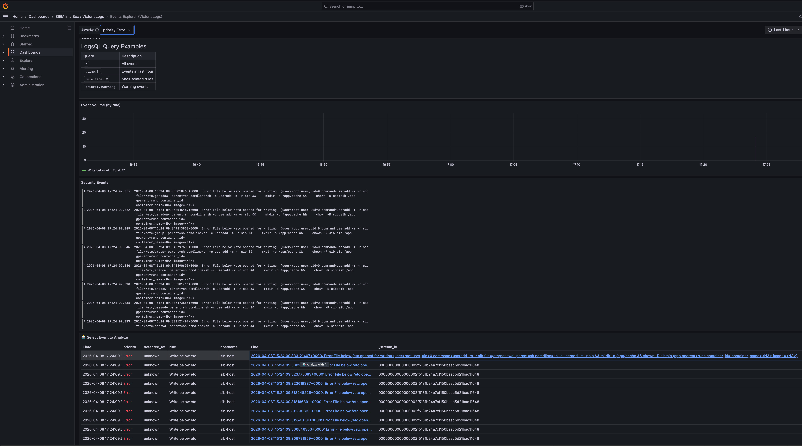

# AI-Powered Alert Analysis

Analyze security events using LLMs — directly from Grafana.

[← Back to Home](index.md)

---

> ⚠️ **BETA**: This feature is in active development. APIs and configuration may change.

## Overview

Got an alert but not sure what it means? SIB can analyze your security events using Large Language Models to provide:

- **Attack Vector Identification** — What the attacker is trying to do
- **MITRE ATT&CK Mapping** — Tactic and technique IDs
- **Risk Assessment** — Severity, confidence, impact
- **Mitigation Strategies** — Immediate, short-term, long-term actions
- **False Positive Assessment** — Is this real or noise?

---

## Quick Start

```bash
# Install the AI Analysis service
make install-analysis
```

You'll be prompted for your server's IP/hostname (so Grafana can link to the API). Then:

1. Open **Events Explorer** dashboard in Grafana
2. Click any event row to select it
3. Click **🤖 Analyze with AI** in the bottom panel

---

## Privacy-First Design

Your sensitive data never leaves your network (unless you want it to). Before sending anything to the LLM, data is obfuscated:

| Data Type | What Happens |
|-----------|--------------|
| IP addresses | → `[INTERNAL-IP-1]`, `[EXTERNAL-IP-1]` |
| Usernames | → `[USER-1]` |
| Hostnames | → `[HOST-1]` |
| Container IDs | → `[CONTAINER-1]` |
| Secrets | → `[REDACTED]` |

### Preview Obfuscation

Use dry-run mode to see what gets sent:
```bash
curl "http://localhost:5000/analyze?rule=SomeRule&output=test&dry_run=true"
```

---

## LLM Providers

| Provider | Where data goes | Best for |
|----------|----------------|----------|
| **Ollama** (default) | Your machine | Privacy-conscious users |
| OpenAI | OpenAI API | Better quality |
| Anthropic | Anthropic API | Claude fans |

### Ollama Setup (Recommended)

```bash
# Install Ollama
curl -fsSL https://ollama.com/install.sh | sh

# Pull a model
ollama pull llama3.1:8b

# Verify it's running
ollama list
```

### OpenAI Setup

Set your API key in `analysis/config.yaml`:
```yaml
llm:
  provider: openai
  model: gpt-4
  api_key: sk-your-key-here
```

Or via environment variable:
```bash
export OPENAI_API_KEY=sk-your-key-here
```

### Anthropic Setup

```yaml
llm:
  provider: anthropic
  model: claude-3-sonnet-20240229
  api_key: your-key-here
```

---

## Configuration

Edit `analysis/config.yaml`:

```yaml
# LLM Provider settings
llm:
  provider: ollama  # ollama, openai, or anthropic
  model: llama3.1:8b
  base_url: http://host.docker.internal:11434  # For Ollama

# Obfuscation settings
obfuscation:
  enabled: true
  preserve_structure: true

# Cache settings
cache:
  enabled: true
  ttl: 3600  # seconds

# Server settings
server:
  host: 0.0.0.0
  port: 5000
```

---

## Grafana Integration

After installation, the **Events Explorer** dashboard gets an AI analysis panel:



### Workflow

1. Browse events in the Events Explorer
2. Click a row to select an event
3. The bottom panel shows event details and an "Analyze with AI" link
4. Click to get instant AI-powered analysis in a new tab

### Supported Dashboards

All log panels show the "🤖 Analyze with AI" link:
- **Security Overview** — Critical Events, Recent Events panels
- **Events Explorer** — All log entries
- **MITRE ATT&CK** — Critical & Error Events, MITRE-Tagged Events

---

## Example Analysis Output

```
======================================================================
🔍 SECURITY ALERT ANALYSIS
======================================================================

🎯 Attack Vector:
   An attacker is attempting to modify system configuration files, 
   specifically the dynamic linker cache, likely to inject malicious 
   code or redirect program execution to a compromised library.

📊 MITRE ATT&CK:
   Tactic: Persistence
   Technique: T1547.001 - Boot or Logon Autostart Execution

⚠️  Risk Assessment:
   Severity: 🔴 Critical
   Confidence: High
   Impact: Complete system compromise, ability to execute arbitrary 
   code with root privileges.

🛡️  Mitigations:
   Immediate:
     • Isolate the affected system from the network
     • Quarantine /etc/ld.so.cache~ and restore from backup
   Short-term:
     • Rebuild the affected system from a clean image
   Long-term:
     • Implement file integrity monitoring (FIM)
     • Implement Mandatory Access Control (SELinux or AppArmor)

🤔 False Positive Assessment:
   Likelihood: Low

======================================================================
```

---

## API Reference

### Web Interface

```
GET /analyze?rule={rule}&output={output}&dry_run={true|false}
```

Returns a beautiful HTML page with analysis results.

### JSON API

```bash
curl -X POST http://localhost:5000/api/analyze \
  -H "Content-Type: application/json" \
  -d '{
    "rule": "Write below etc",
    "output": "File below /etc created (user=root file=/etc/ld.so.cache~)",
    "priority": "Warning"
  }'
```

Response:
```json
{
  "attack_vector": "...",
  "mitre_attack": {
    "tactic": "Persistence",
    "technique": "T1547.001",
    "technique_name": "Boot or Logon Autostart Execution"
  },
  "risk_assessment": {
    "severity": "critical",
    "confidence": "high",
    "impact": "..."
  },
  "mitigations": {
    "immediate": ["..."],
    "short_term": ["..."],
    "long_term": ["..."]
  },
  "false_positive": {
    "likelihood": "low",
    "common_causes": ["..."]
  }
}
```

### Health Check

```bash
curl http://localhost:5000/health
```

---

## Managing the Service

```bash
# Start the analysis service
make start-analysis

# Stop the service
make stop-analysis

# View logs
make logs-analysis

# Open shell in container
make shell-analysis

# Reinstall (after config changes)
make install-analysis
```

---

## Troubleshooting

### Analysis Returns Empty

Check Ollama is running:
```bash
curl http://localhost:11434/api/tags
```

### Connection Refused

Ensure the analysis container can reach Ollama:
```bash
# If Ollama is on host, use host.docker.internal
# Check analysis/config.yaml base_url setting
```

### Slow Analysis

- Use a smaller model (e.g., `llama3.1:8b` instead of larger variants)
- Consider using OpenAI/Anthropic for faster responses
- Enable caching in config.yaml

### API Key Issues

For OpenAI/Anthropic, ensure keys are set:
```bash
# Check if key is set
docker exec sib-analysis env | grep API_KEY

# Set in compose.yaml or config.yaml
```

---

## Security Considerations

1. **Local LLM (Ollama)**: All data stays on your infrastructure
2. **Cloud LLMs**: Data is obfuscated before sending, but some context may still be inferred
3. **API Exposure**: The analysis API is bound to 0.0.0.0 by default. Use firewall rules to restrict access
4. **Caching**: Cached results are stored in memory. Restart the container to clear cache

---

[← Back to Home](index.md) | [← Fleet Management](fleet.md)
